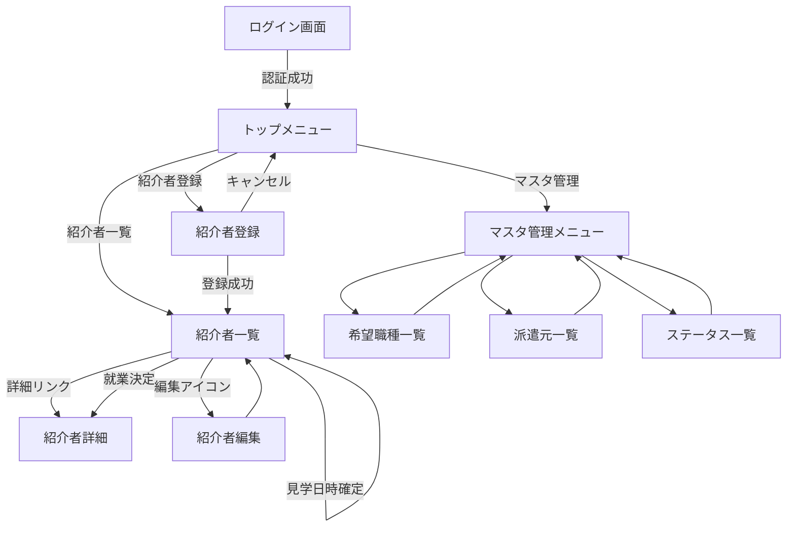

# 短期派遣受入管理システム 要件定義（ドラフト）

> 2025-09-25 追記：ユーザー提供の前提条件を反映しました。

## 0. 稼働環境と前提
- **稼働環境**：Windows Server + IIS10（FastCGI/PHP）、MySQL 8、Laravel 11（PHP 8.3想定）。
- **システム種別**：社内専用の**自社利用システム**（公開なし）。
- **立場**：本システムは*派遣を受け入れる側*で利用。派遣会社からの人物紹介通知が届いた時点から処理を開始。
- **トップメニュー（初期）**：
  - **紹介者登録**（派遣会社から紹介された人物の情報を登録）
  - **紹介者一覧**（検索・並び替え・詳細表示・ステータス変更・修正）
  - **マスタ管理**（希望職種／ステータス／派遣元）
- **DB連携要件**：作成するMySQLデータベースは**Microsoft AccessからODBCリンク**して利用予定。そのため **BIGINT型は使用不可**。整数は `INT`、IDは `INT AUTO_INCREMENT` を採用する。文字列は Access側で互換性の高い `VARCHAR` を基本とする。

## 2. スコープ
- **対象業務（初期）**：派遣会社からの**人物紹介の受付〜管理**、職場見学候補・確定管理、ステータス管理、一覧検索、マスタ管理（希望職種／ステータス／派遣元）。
- **非対象（明確に除外）**：**就業開始以降の処理は対象外**（契約、シフト、勤怠打刻、請求/支払、評価・実績など）。

## 3. 用語定義
| 用語 | 説明 |
|---|---|
| 派遣元（派遣会社） | 候補者を紹介してくる外部の会社。システムへのログインは想定しない（社内専用のため）。 |
| 紹介者（候補者） | 派遣受入の検討対象となる人物。 |
| スキルシート | PDFで受領する候補者の経歴・スキル資料。 |
| 職場見学 | 候補者が就業前に職場を見学するイベント（面談含む場合あり）。 |
| ステータス | 候補者の進捗状態（職場見学待／判定中／就業決定／辞退／見送り）。 |

## 4. 利用者・権限ロール
- **ロール**：
  - 受入担当（社内）：登録・編集・検索・ステータス更新。
  - 管理者（社内）：全権（マスタ管理、監査ログ参照を含む）。
- **権限マトリクス（要約）**：
| 機能 | 受入担当 | 管理者 |
|---|---:|---:|
| 紹介者登録/編集 | ● | ● |
| 職場見学候補/確定 | ● | ● |
| ステータス更新 | ● | ● |
| 一覧の検索・並替 | ● | ● |
| マスタ管理（希望職種/ステータス/派遣元） | × | ● |
| 監査ログ参照 | × | ● |

## 5. 業務フロー（概要）
1. **紹介受領**：派遣元からスキルシートPDF＋紹介文が届く。
2. **登録**：紹介者登録画面で候補者情報・希望職種・派遣元・見学候補（1〜3）・交通費・その他条件・初期ステータス（職場見学待）を入力。
3. **見学調整**：候補日から**見学日時を確定**（ボタン操作で昇格）。
4. **見学実施**：完了後、**ステータス更新**（判定中／就業決定／辞退／見送り）。
5. **就業決定**：就業開始日を登録して**管理完了**。見送り/辞退はグレー表示でアーカイブ。

## 6. 機能要件

### 6.A 紹介者（候補者）管理
- **トリガー**：派遣会社からの人物紹介（スキルシートPDF＋紹介文）受領。
- **登録項目**：
  - スキルシート（PDF添付／プレビュー）
  - 紹介文（動的に追加入力できる可変長エリア）
  - 希望職種（第1〜第3希望、マスタ参照のコンボボックス）
  - 派遣会社（マスタ参照のコンボボックス）
  - 職場見学対応者（最大2名、社内ユーザーから選択／検索）
  - 紹介日（受領日）
  - 職場見学希望候補（第1〜第3候補、【日付のみ】または【日付＋時間】）
  - 交通費（日額・月額）
  - その他条件（可変長・複数行の追加入力エリア）
  - ステータス（初期値：**職場見学待**）
  - 状態変化日（初期値：登録日）
- **職場見学**：候補提示→確定日時を1クリックでセット（候補の昇格）。
- **見学完了後**：ステータス変更（`職場見学待`/`判定中`/`就業決定`/`辞退`/`見送り`）。
- **色表現（UIガイド）**：`辞退`・`見送り`＝グレー系／`就業決定`＝明るい色。
- **就業決定時**：就業開始日の登録を必須化（未設定なら警告）。
- **閲覧ログ（新規）**：
  - 紹介者の**詳細表示／一覧の行展開**をトリガーに、**ユーザー別の閲覧履歴**を自動記録（初回閲覧日時・最終閲覧日時・閲覧回数）。
  - 未閲覧＝**当該ユーザーの履歴が存在しない**状態。
  - 一覧で**未閲覧バッジ（●）**を表示（ツールチップ：未閲覧）。
  - 行アクションとして「**未読に戻す**」（自分の閲覧履歴を削除）を用意（任意）。
- **一覧・検索**：複合条件検索（氏名、派遣会社、希望職種、ステータス、紹介日/見学日範囲、**閲覧状態（未閲覧/閲覧済）**）、並び替え（紹介日降順既定、見学日、ステータス、派遣会社、**閲覧状態**）。

### 6.B マスタ管理
- **希望職種マスタ**：名称、表示順、使用可否。
- **ステータスマスタ**：コード、表示名、表示色（16進）、表示順、使用可否。
- **派遣元（派遣会社）マスタ**：名称、担当者、連絡先（電話・メール）、備考、使用可否。
- 参照整合性：紹介者登録画面のコンボはマスタを参照（使用可のみ表示）。
- CSVインポート／エクスポート（UTF-8、BOMなし）※初期投入想定。

### 6.C 通知（期日リマインド：**実装対象**）
- **対象期日**：職場見学の**確定日時**（interviews.scheduled_at）。
- **通知手段**：社内メール（SMTP／IIS Smtpまたは社内SMTP）。
- **通知タイミング（既定）**：
  - 前日 09:00（ローカルタイム）
  - 1時間前
  - **30分前（既定ON）**
- **通知先**：
  - **職場見学対応者（最大2名・必須）**
  - 受入担当（登録者）
  - **管理者にCC**（既定ON）
- **メール内容（雛形）**：件名・本文はテンプレートを用意（下記「メールテンプレート」を参照）。
- **設定**：候補者/見学ごとに「30分前リマインドON/OFF」を切替可能（既定ON）。
- **再送ルール**：重複防止（同一イベント・同一タイミングは一度のみ）。
- **失敗時**：送信失敗はアプリ内ログ＋管理者通知（ダイジェスト）。

## 7. 非機能要件
### 7.1 パフォーマンス
- 同時利用：想定同時ログイン 200 ユーザ、ピーク時レスポンス < 2秒（P95）。
- バッチ（請求集計）：10万レコード/30分以内。

### 7.2 可用性・運用
- 稼働率目標 99.5%（平日8–20時SLA重視）。
- 監視：AP/DB/Queue、エラートラッキング、死活監視。
- バックアップ：DBフル1日1回＋増分、保管30日、リストア訓練半期1回。

### 7.3 セキュリティ
- 認証：メール＋パスワード、MFA（任意）／IP制限（任意）。
- 権限：RBAC（ロール基盤）＋オブジェクトレベルポリシー。
- 交通費等の個人情報・口座情報は**暗号化**（保存時）。
- OWASP ASVS L1相当、CSRF/XSS/SQLi対策、強制パスワードポリシー。
- 監査ログのWORM的保全（削除や編集不可方針）。

### 7.4 法令・規程（要確認）
- 労働者派遣法、個人情報保護、就業規則／36協定の範囲。
- 法的助言は行わないため、**法務・人事と要レビュー**。

## 8. データ要件（概要）

### 8.1 主要エンティティ
- **紹介者（Candidates）**、**派遣会社（Agencies）**、**ステータス（CandidateStatuses）**、**スキルシート（SkillSheets）**、**見学予定（Interviews）**、**ステータス履歴（CandidateStatusHistories）**、**希望職種（JobCategories）**

### 8.2 テーブル例（抜粋）
| テーブル | 主キー | 主な項目 | 備考 |
| users | id | name, email, role(admin/user), is_active | 社内ユーザー（対応者選択の対象） |
| candidates | id | name, kana, agency_id, wish_job1..3(job_category_id), introduced_on, visit_candidate1..3(date/datetime), transport_cost_day, transport_cost_month, other_conditions(json/text[]), status_code, status_changed_on, start_on, handler1_user_id(null), handler2_user_id(null) | 紹介者 |
| agencies | id | name, contact_person, email, phone, note, is_active | 派遣会社マスタ |
| candidate_statuses | code | label, color, sort_order, is_active | ステータスマスタ |
| job_categories | id | name, sort_order, is_active | 希望職種マスタ |
| skill_sheets | id | candidate_id, file_path, received_on, note | スキルシートPDF |
| interviews | id | candidate_id, scheduled_at, place, result, memo, remind_prev_day_sent(bool), remind_1h_sent(bool), remind_30m_sent(bool), remind_30m_enabled(bool default true) | 職場見学確定＋リマインドフラグ |
| notifications | id | type(reminder), target_id(interview_id), to(email[]), cc(email[]), subject, body, scheduled_for, sent_at, status, error | 通知履歴 |
| candidate_views | id | candidate_id, **user_id**, first_viewed_at(datetime), last_viewed_at(datetime), view_count(int) | **ユーザー別の閲覧履歴**（未閲覧判定に使用） |
| candidate_status_histories | id | candidate_id, old_code, new_code, changed_by, reason, changed_at | 状態変更履歴 |

> 注：契約・シフト・勤怠・請求に関するテーブルは**本システムの対象外**。

## 9. 画面要件（主要）

## 9.X 画面遷移定義
### 概要
Laravelの既定ダッシュボード画面ではなく、本システム独自の**トップメニュー画面**を初期表示とする。ログイン後は必ずトップメニューに遷移することを仕様で固定する。

### 遷移表
| From | アクション/条件 | To | 備考 |
|---|---|---|---|
| ログイン画面 | 認証成功 | トップメニュー | Laravel既定の /home ではなく独自ビューを表示 |
| トップメニュー | 「紹介者登録」クリック | 紹介者登録画面 | 新規登録フォーム |
| トップメニュー | 「紹介者一覧」クリック | 紹介者一覧画面 | 検索＋一覧表示 |
| トップメニュー | 「マスタ管理」クリック | マスタ管理メニュー | 希望職種／派遣元／ステータスを選択 |
| 紹介者登録画面 | 登録成功 | 紹介者詳細画面 or 紹介者一覧 | 実装時にどちらへ戻すかオプション化（初期値は一覧へ戻る） |
| 紹介者登録画面 | キャンセル | トップメニュー |  |
| 紹介者一覧画面 | 行選択／詳細リンク | 紹介者詳細画面 | 読取中心ビュー |
| 紹介者一覧画面 | 編集アイコン | 紹介者編集画面 | 編集後は詳細画面 or 一覧に戻る |
| 紹介者一覧画面 | ステータス変更 | Ajax更新（同一画面） | 即時反映／色バッジ更新 |
| 紹介者一覧画面 | 見学日時確定 | モーダル入力 | Ajax更新 or 一覧再描画 |
| 紹介者一覧画面 | 就業決定 | 詳細画面 | 就業開始日入力必須 |
| マスタ管理メニュー | 「希望職種」クリック | 希望職種一覧／編集 | インポート／エクスポート対応 |
| マスタ管理メニュー | 「派遣元」クリック | 派遣元一覧／編集 | 同上 |
| マスタ管理メニュー | 「ステータス」クリック | ステータス一覧／編集 | 同上 |
| 各マスタ編集 | 保存 | マスタ一覧 |  |
| 各マスタ編集 | キャンセル | マスタ一覧 |  |

### 画面遷移図（Mermaid記法）

---|---|---|---|
| ログイン画面 | 認証成功 | トップメニュー | Laravel既定の /home ではなく独自ビューを表示 |
| トップメニュー | 「紹介者登録」クリック | 紹介者登録画面 | 新規登録フォーム |
| トップメニュー | 「紹介者一覧」クリック | 紹介者一覧画面 | 検索＋一覧表示 |
| トップメニュー | 「マスタ管理」クリック | マスタ管理メニュー | 希望職種／派遣元／ステータスを選択 |
| 紹介者登録画面 | 登録成功 | 紹介者詳細画面 or 紹介者一覧 | 実装時にどちらへ戻すかオプション化（初期値は一覧へ戻る） |
| 紹介者登録画面 | キャンセル | トップメニュー |  |
| 紹介者一覧画面 | 行選択／詳細リンク | 紹介者詳細画面 | 読取中心ビュー |
| 紹介者一覧画面 | 編集アイコン | 紹介者編集画面 | 編集後は詳細画面 or 一覧に戻る |
| 紹介者一覧画面 | ステータス変更 | Ajax更新（同一画面） | 即時反映／色バッジ更新 |
| 紹介者一覧画面 | 見学日時確定 | モーダル入力 | Ajax更新 or 一覧再描画 |
| 紹介者一覧画面 | 就業決定 | 詳細画面 | 就業開始日入力必須 |
| マスタ管理メニュー | 「希望職種」クリック | 希望職種一覧／編集 | インポート／エクスポート対応 |
| マスタ管理メニュー | 「派遣元」クリック | 派遣元一覧／編集 | 同上 |
| マスタ管理メニュー | 「ステータス」クリック | ステータス一覧／編集 | 同上 |
| 各マスタ編集 | 保存 | マスタ一覧 |  |
| 各マスタ編集 | キャンセル | マスタ一覧 |  |

---
0. トップメニュー：**紹介者登録**／**紹介者一覧**／**マスタ管理**
1. ダッシュボード（任意）
2. 紹介者登録（PDF添付、各種コンボ入力、候補日登録）
3. 紹介者一覧（検索・並替、バッジ色表示、行アクション）
4. マスタ管理
   - 希望職種一覧/登録/編集
   - ステータス一覧/登録/編集（色設定）
   - 派遣会社一覧/登録/編集

### 9.A 共通UIスタイルガイド（全画面に適用）
- レイアウト：青系ヘッダー／薄いグレー背景／白カード（角丸2xl、shadow-md〜lg、p-6、カード間space-y-6）。
- カラー：アクセント#2F6BFF（Hover #2B5AE0）、区切り#E6EAF2。ステータス・バッジ：就業決定#E6FFEA、判定中#FFF7CC、職場見学待#E8F0FE、辞退/見送り#CFCFCF。
- コンポーネント：アコーディオン見出しにアイコン、ラベル上・ヘルプ下、日付/時間は分離。ボタンは主要アクションを強調表示。
- アクセシビリティ：AAコントラスト、フォーカスリング可視化（`ring-2 ring-offset-2`）、アコーディオン`aria-expanded`、labelとinputの`for/id`関連付け。
- レスポンシブ：smは1カラム、md以上は2〜3カラムグリッド。テーブルはヘッダ固定・行ホバー・横スクロール。

#### 紹介者登録：PDFドラッグ＆ドロップ
- スキルシートは**ドラッグ＆ドロップ**でアップロード可能（クリック選択も可）。
- 複数PDFの受領に備え**複数ファイル**対応（初期は1件想定／将来拡張可）。
- ドロップ領域：破線枠・アイコン・説明文を表示（例：「ここにPDFをドラッグ＆ドロップ」）。
- 進捗表示：ファイルごとにアップロード進捗バーと結果（成功/失敗）。
- プレビュー：PDFの1ページ目サムネイル／メタ情報（ファイル名・サイズ・アップロード日時）。
- バリデーション：MIME `application/pdf`、拡張子`.pdf`、最大**10MB/1ファイル**（要環境設定）。
- エラー：サイズ超過・MIME不一致・スキャン失敗時に行内エラー表示。

### 9.B 紹介者一覧：検索条件（**必須**）
- 検索パネル（必須）：テーブル上部のカードに以下のフィルタを配置。
  - 自由語（氏名・メモ・その他条件の全文検索）
  - 派遣会社（マスタ）
  - 希望職種（1〜3のいずれかに一致）
  - ステータス（複数選択可）
  - 期間（紹介日 From/To、見学確定日時 From/To）
  - 担当者（職場見学対応者1/2）
  - 30分前リマインドの有効/無効（トグル）
  - **閲覧状態（未閲覧／閲覧済）**
  - 並替：**未閲覧優先 → 紹介日降順（既定）**。その他に見学日時、ステータス、派遣会社、閲覧状態
- 列：氏名／派遣会社／希望職種1〜3／紹介日／見学確定日時／ステータス（色バッジ）／状態変化日／**閲覧**（未閲覧●／閲覧済✓）。
- 行アクション：詳細・編集、ステータス変更、見学日時確定、就業開始日登録（就業決定時）。

## 10. API/連携要件 API/連携要件
- 社内専用のため**公開APIなし**。
- **メール送信**：社内SMTP（認証/ポート/SSL設定は環境変数）。
- CSV入出力（マスタ／一覧エクスポート）のみ。

## 11. 運用・保守（簡略）
- 認証：社内アカウント（メール＋パスワード）、IP制限（任意）。
- バックアップ：DBフル1日1回、30日保持。
- ログ：操作ログ（登録・更新・削除）、ファイルアップロード履歴、**通知送信ログ**。
- キュー/スケジューラ：Laravel Queue（Redis）＋Scheduler（cron）で**リマインドジョブ**を実行、リトライは指数バックオフ（例：1m/5m/15m）。

## 12. 受入基準（抜粋）
- 紹介者登録〜一覧反映が正常に実施でき、検索・並替が期待通り。
- ステータス色がマスタ設定通りに表示。
- 就業決定時、就業開始日が未設定なら警告が出る。
- **見学リマインドメール**が「前日9:00／1時間前／**30分前（既定ON）**」に送信され、重複送信がない。失敗時はログが記録される。
- **閲覧ログ**：
  - 詳細表示または行展開で当該ユーザーの閲覧履歴が作成・更新される。
  - 一覧の**未閲覧/閲覧済バッジ**が正しく反映され、**閲覧状態フィルタ**で絞り込みできる。

