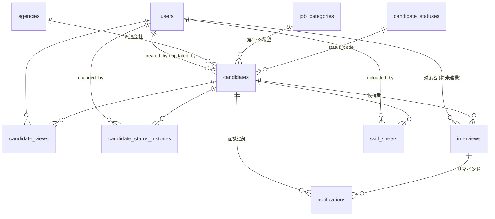

# 詳細設計メモ（ドラフト）

作成日: 2025-09-25  
対象: 短期派遣受入管理システム  
目的: 要件定義書に基づき、開発開始前に必要な詳細仕様・設計判断・未決事項を整理する。

---

## 1. 全体方針
- フレームワーク: Laravel 11 / PHP 8.3。
- テンプレート: Blade + Tailwind CSS（既存の Vite 構成を利用）。
- DB: MySQL 8。Access から ODBC 連携を行うため、数値型は `INT` を基本とし、`BIGINT` は使用しない。
  - 2025-09-25 時点でローカル `temp_emp_mng`（MySQL 8.0）に全マイグレーション適用済み。接続ユーザー `root`（パスワード無し）を開発環境の既定とする。
- 認証: Laravel Breeze 相当のメール＋パスワード方式をベースにカスタマイズ。MFA・IP 制限は追加機能として設計余地を残す。
- 主要ロール: `manager`（管理者）と `staff`（受入担当）。

## 2. 機能別詳細仕様

### 2.1 トップメニュー
- ルート: `/dashboard` をトップメニューにリネームし、ログイン後に必ず遷移。
- 表示カード: "紹介者登録" "紹介者一覧" "マスタ管理" の 3 枚。
- アクセス制御: `staff`・`manager` 共通だが、マスタ管理カードは `manager` のみアクティブ表示。

### 2.2 紹介者登録・編集
- URL: `/candidates/create`, `/candidates/{id}/edit`。
- 入力グルーピング:
  1. 基本情報: 氏名（必須 50 文字）、カナ（必須 50 文字）、派遣会社（必須）、紹介日（必須、初期値 = 当日）。
  2. 希望職種: 第1〜3 希望（任意、同一職種選択可）。マスタから `is_active = true` のみ表示。
  3. 職場見学候補: 3 枠まで（日時 or 日付のみ）。UI 上は日付ピッカー＋時間入力（任意）。
  4. 対応者: 社内ユーザー（`users` テーブルの `is_active = true`）から最大 2 名選択。必須。
  5. 条件: 交通費（日額 int unsigned, 月額 int unsigned, いずれも 0 以上）、その他条件（可変長テキスト、最大 2000 文字）。
  6. ステータス: 初期値 `visit_pending`（職場見学待）。編集画面ではマスタに沿って選択。
  7. スキルシート: PDF 複数ファイル対応（最大 5 件／各 10 MB）。
- バリデーション: Laravel FormRequest で実装。
- エラー表示: 各フィールド配下に Tailwind の `text-red-600` で表示。アップロードエラーはカード内に集約。

### 2.3 スキルシートアップロード
- 保存先: `storage/app/private/skill_sheets/{candidate_id}/`。
- ファイル名: `{candidate_id}_{timestamp}_{original_name}`。
- MIME チェック: `application/pdf` のみ。`
- PDF プレビュー: 一覧はファイル名＋サイズ＋アップロード日時。1 ページ目サムネイルは将来対応項目としてバックログに回す。
- ウイルススキャン: 既存環境での実施可否未確定（**要確認**）。暫定は手動チェック運用とし、運用手順書へ記載予定。

### 2.4 紹介者一覧
- ルート: `/candidates`。
- 検索条件とUI:
  - 折りたたみ式（既定 open）。
  - ビルトイン検索コンポーネント（Blade コンポーネント予定）で入力→QueryString 反映。
  - 未閲覧バッジは `●`（太字青）/閲覧済は `✓`（グレー）。
- 並び順: 既定 `未閲覧優先 → 紹介日降順`。SQL 上は `view_state`（CASE WHEN）＋`introduced_on` DESC。
- Ajax 更新: ステータス変更・見学確定はモーダル＋Livewire（採用予定）または Inertia.js（要検討）。暫定案は **Livewire** を採用（Laravel 11 の標準サポートが拡充）。

### 2.5 職場見学確定モーダル
- 入力項目: 確定日時（必須）、場所（テキスト 100 文字）、メモ（500 文字）。
- 設定時: `interviews` テーブルにレコード作成、既存候補日は `candidate` レコードに保持。
- リマインドフラグ: `remind_30m_enabled` をモーダルで ON/OFF 切替可能。

### 2.6 ステータス遷移ルール
- 遷移パターン:
  - `visit_pending` → `visit_confirmed`（見学確定）
  - `visit_confirmed` → `under_review`
  - `under_review` → `hired` / `declined` / `rejected`
- `hired` 選択時、就業開始日 (`start_on`) 入力ダイアログを表示。未入力なら保存不可。
- `declined` / `rejected` は表示上グレーでアーカイブ扱い。以後編集不可、一覧では折りたたみセクションに分離予定。

### 2.7 閲覧ログ
- トリガー: 詳細画面遷移 or 一覧で行展開時に Ajax 呼び出し。
- `candidate_views` 更新ルール: レコードがあれば `last_viewed_at` と `view_count`++、なければ新規作成。
- 「未読に戻す」: 自ユーザーの該当レコードを削除。
- 一覧フィルタ: `LEFT JOIN candidate_views AS cv ON cv.candidate_id = candidates.id AND cv.user_id = :authUserId` を利用。

### 2.8 マスタ管理
- 各マスタ: 一覧 → 新規/編集ダイアログ（モーダル） → CSV インポート/エクスポート。
- CSV 仕様: UTF-8 (BOM なし)。1 行目ヘッダ必須。バリデーション結果は一覧上部に集計表示。
- Soft Delete: `is_active` フラグのみで制御。削除機能は暫定実装しない。

### 2.9 ユーザー管理
- 初期データ: `DatabaseSeeder` に管理者 1 名／受入担当 2 名を作成。
- パスワードリセット: Laravel 標準メール送信を利用。
- アカウントロック: 連続失敗 5 回で 10 分ロック（Laravel Fortify の throttle 機構を利用）。

---

## 3. データモデル詳細（抜粋）

### 3.1 ER 図（概略）

| テーブル | 必須カラム | 型・制約 | 備考 |
|---|---|---|---|
| users | `id`, `name`, `email`, `password`, `role`, `is_active`, `created_at`, `updated_at` | `id` INT AI, `role` ENUM('manager','staff'), `is_active` TINYINT(1) | 監査用に `last_login_at` 追加予定 |
| candidates | `id`, `name`, `name_kana`, `agency_id`, `wish_job1_id`, `wish_job2_id`, `wish_job3_id`, `introduced_on`, `visit_candidate1_at`, `visit_candidate2_at`, `visit_candidate3_at`, `handler1_user_id`, `handler2_user_id`, `transport_cost_day`, `transport_cost_month`, `other_conditions`, `status_code`, `status_changed_on`, `start_on`, `created_by`, `updated_by`, `created_at`, `updated_at` | `status_code` は `candidate_statuses.code` 参照。 `other_conditions` は JSON 型（Access 互換を考慮し TEXT として保存し JSON エンコード）。 | `handler` は NULL 許可、UI では必須運用。 |
| skill_sheets | `id`, `candidate_id`, `file_path`, `original_name`, `size_bytes`, `uploaded_by`, `uploaded_at` | `file_path` はストレージ相対パス。 | |
| interviews | `id`, `candidate_id`, `scheduled_at`, `place`, `memo`, `remind_prev_day_sent`, `remind_1h_sent`, `remind_30m_sent`, `remind_30m_enabled`, `created_at`, `updated_at` | `scheduled_at` DATETIME、`remind_*` は TINYINT(1) | 重複防止フラグとして使用。 |
| notifications | `id`, `type`, `target_id`, `to_addresses`, `cc_addresses`, `subject`, `body`, `scheduled_for`, `sent_at`, `status`, `error_message`, `created_at`, `updated_at` | `to_addresses` `cc_addresses` は JSON(TEXT)。 | |
| candidate_views | `id`, `candidate_id`, `user_id`, `first_viewed_at`, `last_viewed_at`, `view_count` | 主キーは単一 ID、`candidate_id`,`user_id` にユニーク制約。 | |
| candidate_status_histories | `id`, `candidate_id`, `old_code`, `new_code`, `changed_by`, `changed_reason`, `changed_at` | `changed_reason` TEXT（任意）。 | |
| job_categories | `id`, `name`, `sort_order`, `is_active`, timestamps |  | |
| candidate_statuses | `code`, `label`, `color_code`, `sort_order`, `is_active`, timestamps | `code` VARCHAR(20)。 | |
| agencies | `id`, `name`, `contact_person`, `email`, `phone`, `note`, `is_active`, timestamps |  | |

---

## 4. バリデーション & ビジネスルール

- 氏名・カナ: 全角・半角双方許容。カナはカタカナで入力させるため、バリデーションで `regex:/^[ァ-ヴー\s]+$/u`。
- メール: Laravel 標準 `email`。
- 交通費: 数値入力（0 以上）。万が一空欄なら `null` 保存。
- 日付/日時: `Carbon` で正規化。Access 連携のため、DATE/DATETIME を使用（TIMESTAMP は避ける）。
- ステータス変更時: `CandidateStatusHistory` に必ずレコード追加。`changed_reason` はオプション（任意入力欄をモーダルに用意）。

---

## 5. ファイル & ストレージ管理
- ローカル開発: `storage` ディレクトリに保存。`php artisan storage:link` で公開は行わず、ダウンロードは認可付きコントローラ経由。
- 本番: Windows Server のローカルストレージを使用。NAS 連携案もあるが未定。
- バックアップ: 日次バックアップ対象。Acronis など既存仕組みと調整（**要インフラ確認**）。
- ファイル削除: 候補者削除禁止（論理削除なし）方針のため、スキルシートも基本保持。

---

## 6. 監査ログ・操作ログ
- 監査対象操作: ログイン、候補者 CRUD、ステータス変更、見学確定、マスタ更新、閲覧ログ「未読に戻す」。
- 実装案: `activity_log` テーブルを新設し、`spatie/laravel-activitylog` を利用予定。
- 保持期間: 無期限（WORM 方針）。アクセス権は管理者のみ。

---

## 7. 未決事項 & ToDo
| 項目 | 現状 | 対応案 |
|---|---|---|
| PDF ウイルススキャン | バックエンド実装未定 | 情シスと要確認。実装しない場合は運用ルール記載 |
| Livewire / Inertia 選定 | Livewire 案を優先 | プロトタイプ作成時にパフォーマンス・保守性で再評価 |
| メールテンプレート正式文面 | 仮テンプレートのみ | 実運用部門にヒアリングし確定 |
| 監視ツール | 既存サーバ監視に準拠 | 情シスと連携（Zabbix / PRTG 等） |
| アクセスログ保管 | IIS 標準ログ | 解析基盤（SIEM）との連携検討 |

---

## 8. 次アクション
1. 本メモ内容を関係者レビュー → 未決項目の責任者を確定。
2. UI プロトタイプの作成：トップメニュー、紹介者一覧、登録フォームのスタティックビュー。
3. ER 図・マイグレーション草案の作成。
4. 通知ジョブ設計書のドラフト作成。
5. セキュリティ・運用ドキュメントの骨子作成。

---

> 本メモはドラフトです。レビュー結果に応じて更新します。
